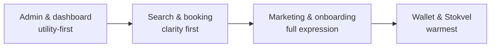

# Applying the Brand

How strongly the brand is expressed depends on the surface.

---

| Surface | Notes |
|---|---|
| **Marketing site & app onboarding** | Full expression of the brand: Ivory canvas, serif headlines, gold crest, aspirational but approachable photography (real people, real trips, not stock luxury clichés) |
| **Search & booking flow** | Brand recedes in favour of clarity: Navy text on Ivory/Warm White, Gold reserved for CTAs and "Curated Pick" badges, generous white (ivory) space so results never feel like a dense list |
| **Wallet / Group Savings ("Stokvel")** | Warmest expression of the brand; this is the emotional core of the product. Progress bars, contribution avatars and milestones can use Gold generously here to celebrate progress |
| **Property owner dashboard & admin** | Utility-first: Navy/Ink text on Warm White cards, Gold used sparingly for status and verification badges only |
| **Retargeting / destination ads** | Keep the calm, curated feel even in performance marketing. Avoid cluttered ad templates; let one destination or deal breathe per creative |

---

## Brand Intensity by Surface

