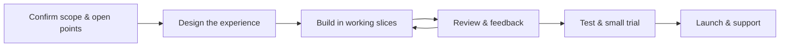

# How We Work

Work happens in **short, visible steps** rather than long stretches of silence.

---

1. **Confirm scope** and the [open points](../decisions.md), then design the experience.
2. **Build in working slices**, with progress shown every couple of weeks.
3. **Review and give feedback**; adjust accordingly.
4. **Test thoroughly**, run a small trial, then launch and support the platform.

See the [Roadmap](../roadmap.md) for the indicative timeline.
