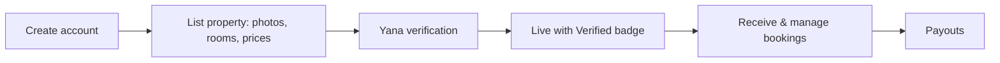

# For Property Owners

Yana gives property owners **more bookings and simple tools to manage them**: a profile, room and price control, a booking calendar, payouts and a clear dashboard.

---

## Getting Listed

1. **Create an account** and list a property with photos, rooms and prices.
2. **Verification:** the Yana team verifies properties before they go live and awards a verification badge. See [Property Verification](../trust-verification.md).
3. **Go live** and start receiving bookings.

---

## Managing Your Property

| Task | What you can do |
|---|---|
| **Availability** | Set availability and block dates |
| **Pricing** | Change prices by date and offer discounts |
| **Bookings** | Receive and manage bookings |
| **Guests** | Message guests and reply to reviews |
| **Money** | See revenue and payouts |
| **Promotions** | Run your own promotions |

Everything runs from a clear [dashboard](../users-access/property-owners.md).

---

## Getting Paid

Commission is collected automatically through a **Paystack payment split** at the moment of payment: the property receives its share and Yana's commission is taken automatically. "Pay at the property" bookings are invoiced to the property. See [Commission & Payments](../commission.md).

---

## Connecting Your Existing System

Yana connects to properties through a **channel manager** rather than integrating with each property system individually, to keep availability accurate. The main systems in use are reviewed during onboarding.
