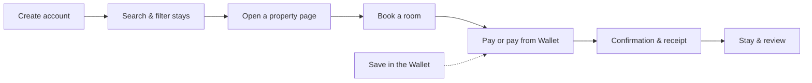

# For Travellers

YCHP is designed so a first-time traveller can go from an idea to a confirmed, paid booking **without feeling lost or intimidated**.

---

## The Journey

---

## Step by Step

### 1. Create an account

Create an account and manage your profile and past trips.

### 2. Find a stay

Search by city, country, region, hotel name, landmark, airport or map, with flexible dates, then narrow the results with filters. See [Search & Discovery](../features/search-discovery.md).

### 3. Choose a property

Each [property page](../features/property-pages.md) shows photos, description, map, amenities, rules, check-in/check-out times, cancellation policy and available rooms.

### 4. Book and pay

Book a room (including on behalf of someone else) with a clear summary before paying. Pay by card, Apple Pay, Google Pay, at the property, or pay later. See [Booking & Payments](../features/booking-payments.md).

### 5. Save toward the trip

Put money aside in the [Savings Wallet](../wallet/index.md) and check the balance at any time, alone or [as a group](../wallet/group-savings.md).

### 6. During and after the stay

Message the property, review a completed stay, cancel or request a refund, and receive notifications. See [Messaging, Reviews & Notifications](../features/messaging-reviews.md) and [Cancellations & Refunds](../cancellations.md).

---

!!! tip "Want someone to plan it for you?"
    Use the **Curation** tab to request a curated experience. See [Curation](../features/curation.md).
