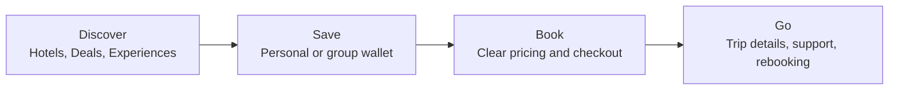

# Yana

**Yana, by Your Curated Holiday Planner.** Curated travel. A smarter way to save for it.

Yana is a curated travel platform designed to make exceptional holidays feel **achievable, not intimidating**. It combines selected luxury stays and experiences with a built-in wallet that lets people save toward travel over time, either on their own or together with family and friends.

!!! quote "The Yana promise"
    Turn *"one day"* into *"we're going"*, by helping people discover, save for and book exceptional travel.

!!! info "What changed in the September 2026 vision"
    - The product is now called **Yana**, presented as *Yana by Your Curated Holiday Planner*.
    - **Group Saving moves into Phase 1.** See [Phases](phases.md).
    - **Cruises and gift cards** are confirmed for Phase 3.
    - The interface moves to a **light, blue-led palette**. See [Colour Palette](brand/colour.md).
    - New **launch priority**: if something must move to protect timing, Hotels, Deals, Experiences, Curation and both wallet modes are protected first.

---

## Four Pillars

| Pillar | What it means |
|---|---|
| **Curated, not cluttered** | A considered set of stays, offers and experiences rather than endless search results |
| **Save your way** | Put money aside for a trip over time instead of treating travel as one large, all-at-once expense |
| **Travel together** | Group saving makes shared holidays easier to organise, fund and understand |
| **Premium, still welcoming** | Luxury in the experience and design, without making the product feel exclusive or intimidating |

!!! tip "A product principle"
    Yana is not a budget travel app. It is a luxury travel platform that gives people a more realistic way to fund and organise exceptional trips.

---

## Launch Tabs

| Tab | Purpose |
|---|---|
| **Hotels** | Curated stays |
| **Deals** | Strong-value offers |
| **Curation** | Request bespoke help |
| **Experiences** | Dining, spa, tours and more |
| **Wallet** | Save alone or together |

Flights, car hire and the AI travel assistant expand the journey once the launch foundation is stable. More detail in [Launch Tabs](features/launch-tabs.md).

---

## One Journey, Inspiration to Departure

Discovery creates desire. The wallet turns desire into progress. Booking turns progress into a confirmed trip.

---

## Who Is It For?

| Audience | What they need | How Yana responds |
|---|---|---|
| **Travellers** | Beautiful options they can trust, with a manageable path to booking | Curated stays and deals, clear pricing, a wallet, group saving and guidance |
| **Property partners** | Incremental bookings without losing control of rates and availability | A partner profile, inventory and availability tools, payouts, promotions and reporting |
| **Yana team** | Control of quality, money, support and merchandising | Admin controls for approvals, bookings, payments, promotions, disputes and reporting |

Start here:

- [For Travellers](getting-started/travellers.md): from first idea to a confirmed booking
- [For Property Owners](getting-started/property-owners.md): list a property and manage bookings

---

## How the Docs Are Organised

| Section | Covers |
|---|---|
| **Platform** | Every feature, the Yana Wallet and how users and roles work |
| **Trust & Safety** | Property verification, cancellations and refunds, wallet regulation and legal |
| **Business** | Market, differentiators, commission, phases, roadmap, decisions and success metrics |
| **Brand** | Colour, UI principles, typography, logo, voice & tone and how the brand applies across the product |
| **Development** | How the team works and how to run and contribute to these docs |

!!! info "Companion documents"
    Two companion documents are maintained separately: the **Product Requirements Document** (every feature described in full) and the **Technical Requirements Document** (the build approach for web and mobile).

> **The north star:** if Yana works, people should stop saying *"maybe one day"* and start saying *"we are already saving for it."*

*Source: "Yana – Product Vision & Roadmap", v1.0, September 2026.*
