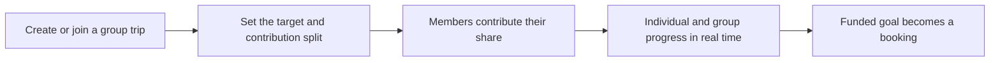

# Group Saving

Friends or family **save together toward one trip**, in the spirit of a **stokvel**. It is a defining differentiator and something mainstream booking sites don't offer.

---

## How It Works

The flow borrows the transparency of cost-splitting tools such as **Tricount** while remaining clearly Yana. Each member understands the **total trip goal, their share, what they have contributed and what remains**.

- Create or join a group trip.
- Set the trip target and contribution split.
- See individual and group progress in real time.
- Send reminders and contribution notifications **without exposing unnecessary financial information**.
- Move from funded goal to booking **without repeating the planning process**.

---

## Timing

!!! info "Phase 1"
    Group Saving is treated as a **Phase 1** launch feature unless a technical or legal dependency makes that impossible. The launch trial cohort tests group contributions before public launch. See [Roadmap](../roadmap.md).

---

## Oversight

The Yana team oversees the wallet and group saving area from the [admin area](../users-access/admin.md). Regulatory requirements are handled with a licensed financial partner (current direction: FNB). See [Wallet Regulation](../wallet-regulation.md).
