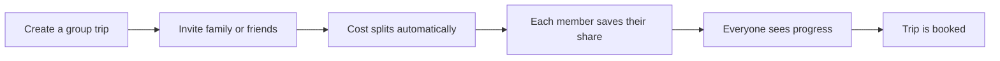

# Group Savings (Stokvel)

A group can **save together toward one trip**, in the spirit of a **stokvel**. This is a strong fit for the audience and something mainstream booking sites don't offer.

---

## How It Works

The model follows a **Tricount-style split**: when multiple people save toward one trip,

- the cost **splits automatically**;
- everyone can see **how much they need to save**;
- everyone can see **how much each person has contributed**.

---

## Timing

!!! info "Phase 2, possibly Phase 1"
    Group Savings is planned for **Phase 2**. It has been flagged as a strong selling point, ideally in Phase 1; timing is to be confirmed if it stays in Phase 2.

---

## Oversight

The YCHP team oversees the wallet and group savings ("Stokvel") area from the [admin area](../users-access/admin.md). Regulatory requirements are handled with FNB. See [Wallet Regulation](../wallet-regulation.md).
